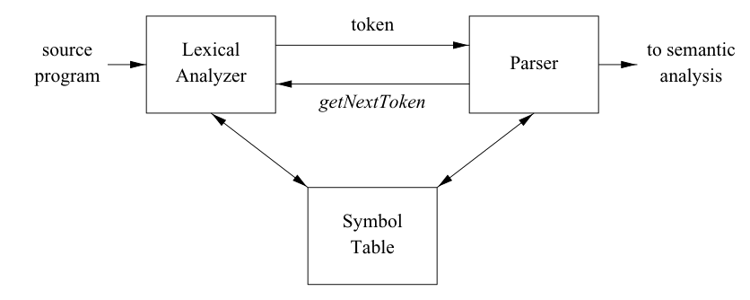

# Part 4

Warning: this will be the most substantial part.

Our _isam.exe_ will be the concrete ISAM reader, supporting single / range selection of Records. We will need to take care of the following problems:

1. index file loading and search support on it
2. database file loading and single / multi Records retrieval (through a "cache-paging system")
3. a decent user interface able to understand simple queries

Let's start with the latter...

## Parsing

We need something able to understand queries like

```
SELECT [id]
SELECT [range]
```

where _[range]_ is something like _[start-id]_ **—** _[end-id]_.

Not a big deal. Maybe calling it a "parser" is a bit too much. Anyway, it will be an ultra minimalist parser. In fact, the grammar is quite simple

```c
statement   → SELECT [expression]
expression  → [id]
              [id] - [id]
id          → POSITIVE INTEGER
```

This style of syntax analysis is called _recursive descent_[^1]. _statement_, _expression_ and _id_ are called **grammar production**: for each one, there is a function. Usually, there is a Lexer, a Parser and a Symbol Table. But our grammar is really simple so we don't need the last one. From the famous Dragon Book (§3.1)...



Based on the grammar and the model above, let's start defining a **Token** class in [token.h](https://github.com/JohnHop/useless_isam/blob/main/token.h)

```C++
enum class Token_type {
  SELECT, RANGE_OPERATOR, POSITIVE_INTEGER,
  end  //end of input
};

struct Token {
  Token_type type;
  std::string value;
};
```

The next step is the **Lexer** (sometime called Scanner) in [lexer.h](https://github.com/JohnHop/useless_isam/blob/main/lexer.h)

```C++
class Lexer {
  std::stringstream input;
  Token current_token;

public:
  Lexer(const std::string& in): input(in), current_token{Token_type::end} { };

  Token get();  //consume the next token from the origin and return it
  const Token& current() const { return current_token; }; //only returns the current token
};
```

The meaning of the Lexer class is to hide the origin (in this case, the `std::cin` standard input), showing to the Parser a sequence of Token and no more. So the Lexer had to recognize a sequence of character and transform it in a Token sequence. This is archieved with the `get()` function implemented in [lexer.cpp](https://github.com/JohnHop/useless_isam/blob/main/lexer.h): it should be easy to understand.

Now it's **Parser**' turn. It is a [Statement](https://github.com/JohnHop/useless_isam/blob/main/statement.h) class that gets Tokens from the Lexer and builds an internal representation for the subsequent action

```C++
class Statement {
  enum Type {
    SELECT_SINGLE, SELECT_RANGE
  };

  Type statement_type;
  int start_id;
  int end_id;

  Lexer lexer;

public:
  Statement(const std::string&);

  void expression();
  int id();

  std::vector<Record> execute(Database& database);
};
```

If you take a look at [statement.cpp](https://github.com/JohnHop/useless_isam/blob/main/lexer.cpp), you will notice that the mothods `expression()` and `id()` match the grammar productions and they are only called inside the `Statement()` constructor. This is also an attempt to follow the RAII rule: if a problem occur parsing the user input, the constructor fails and there is no risk of creating a partially initialized object.

Said that, we can start thinking about the `main()` function with the REPL loop[^2] (a classic).

```C++
int main(int argc, char const *argv[])
{
  std::string input;  //sql statement from standard input
  bool exit{false};

  // Database database{INDEX_FILENAME, DATABASE_FILENAME};

  //REPL
  while(!exit) {
    std::cout << "isam > ";
    std::getline(std::cin, input, '\n');

    if(input == ".exit" || std::cin.eof()) {
      exit = true;
    }
    else {
      Statement statement{input};
    //   std::vector<Record> res = statement.execute(database);

    //   if(res.size()) {
    //     for(auto& e: res) { //showing results
    //       std::cout << e;
    //     }
    //   }
    //   else {
    //     std::cout << "Found 0 records\n";
    //   }
    // }
  }
  return EXIT_SUCCESS;
}
```

Some sections are commented because it's too early to talk about it. 

[^1]: Bjarne Stroustrup. The C++ Programming Language. ̀§10.2.1
[^2]: https://cstack.github.io/db_tutorial/parts/part1.html